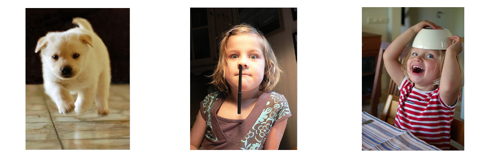
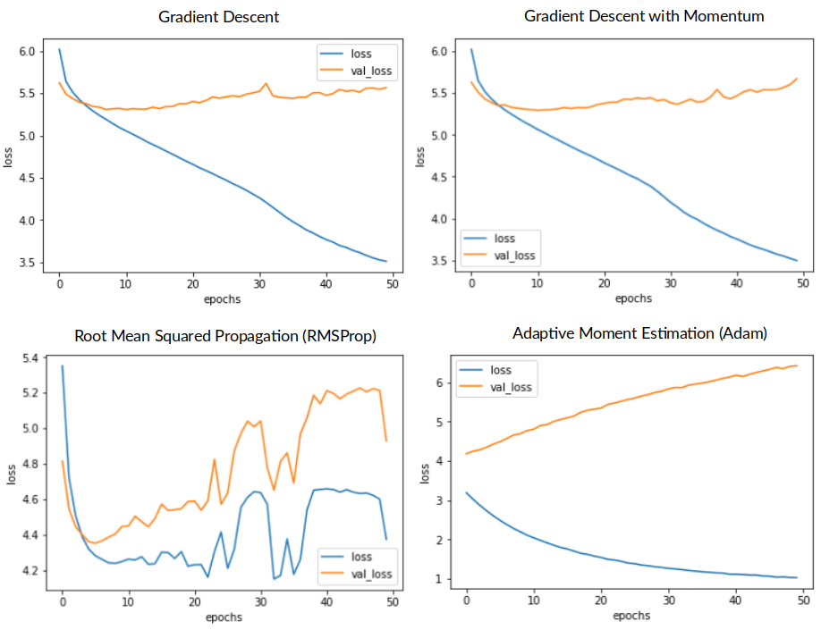
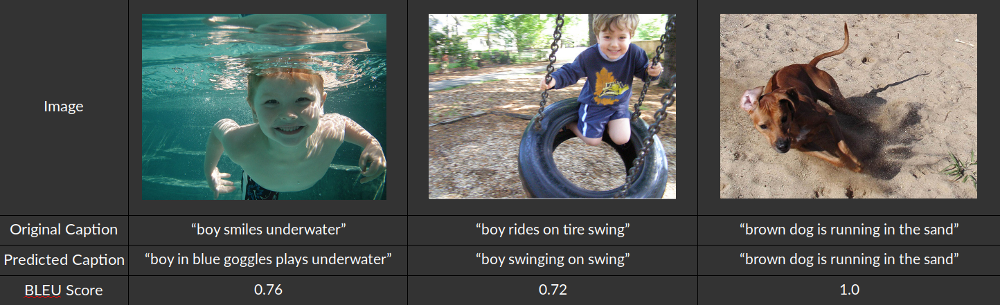

# Automatic Image Captioning with Deep Learning
By Jasmine He December, 2018

Source: ZDNet

## Introduction
Google released the ‘Google’s Conceptual Captions’ dataset for image captioning as a new image-recognition challenge and an exercise in AI-driven education. Since pictures may convey a great deal of information, it is important that we create ways of generating conceptual captions from images automatically and accurately.

This project focus on combining current state-of-the-art techniques in both computer vision and natural language processing in a single jointly-trained system which takes images as inputs and generates human-readable descriptions of them.

## Objective
Develop a useful Deep Learning application which combines both computer vision and natural language processing to create accurate, comprehensible captions from images alone.

Understand the various ways in which we can train Neural Networks more quickly through the use of optimizers?

Understand what’s going on in the model, detailing the inter-relations between components.

Figure 1. Flowchart for automatic image captioning

## Data Overview
I used the flickr8k data set which contains more than eight thousand images and their natural-language captions[1].

Suppose you see these pictures -

Figure 2. Flickr8k image samples

What is the first thing that comes to your mind?

Here are a few sentences that people could come up with:
- Left image: "beige puppy walks across the floor"
- Middle image: "blond girl in brown shirt with black pen up her nose"
- Right image: "little girl smiles as she wears white bowl on the top of her head"

## Model Structure
The task of image captioning can be divided into two models:

    • Image Based Model: extract features from an image
    • Language Based Model: create a sentence about the picture using previous captions together with features given by our image based model.

Below are the details of the above two models:

### Image Based Model – Convolutional Neural Network
I utilize transfer learning to generate image features by feeding the images into a pre-trained VGG16 model. This popular model was developed by Oxford's Visual Geometry Group and in recent times has been used in a variety of image-processing tasks.

### Language Based Model – Recurrent Neural Network
Caption sequences were generated by inputting text into a word embedding layer and feeding the resultant output into a subsequent long short-term memory (LSTM) layer.

LSTM cells are a particular kind of recurrent neural net (RNN) with a more complicated set of internal weights which make them both better able to learn long-term dependencies and less susceptible to the vanishing/exploding gradient problem.

Figure 3. Model Structure

## Data Engineering
I created the following three functions for cleaning my existing set of captions:

    • remove punctuation
    • remove single character
    • remove numeric characters

After cleaning, the vocabulary size was reduced by about 200 tokens, where each token is just a unique word. A word cloud was generated in order to easily determine which words and phrases were the most common.

Figure 4. Word cloud for cleaned captions

## Image Based Model - CNN

### Create features for each image using VGG16's pre-trained networks

Because the VGG16’s pre-trained network requires an input of size (224,224,3), I had to resize all the input images to the same dimensions. Next these re-sized images were sent through the network and encoded into a 4096 size array. These arrays were re-sized once again so as to have the same dimension as the inputs. If this procedure is hard to follow, consult the flowchart below.

Figure 5. Flowchart for imaged based model

### PCA Visualization of the VGG16 features
For each image, 4096 features are created, reflecting the dimensions of the array passed through the network. Because humans lack the circuitry required to visualize a 4096-dimensional space, I created 2-dimensional representation of the space using PCA and visualized the distribution of the sample images.

### Do photo features make sense?
I used k-means clustering on the VGG16 features to separate the images into 4 different clusters.

Figure 6. Embedding plot for a subset of 1000 VGG16 features

I then plotted images from the purple and blue cluster. As you can see, images from the blue cluster tend to resemble each other and images from the purple cluster to resemble each other.

I therefore submit that this clustering schema makes sense.

Figure 7. Image samples for the purple cluster and the blue cluster

## Language Based Model – RNN

My goal is to build a Language Based Model using an RNN. Here’s what that means: for a given sequence of words of length *n*, the model has a set of probabilities corresponding to predictions about what the next word *n + 1* will be. It chooses the highest-probability word from this distribution and continues this process until it generates the special end marker “endseq”, which appears at the end of each sentence in the corpus.

RNNs are sometimes depicted as being "unfolded" to their full extent. By 'unfolding' we simply mean that we write out the network as it would appear as it processes an input. For example, image that we're dealing with a sentence consisting of 5 words. In this case I would vectorize these words, producing five vectors, each of which would be paired with the input image and fed into the corresponding cell of the RNN.

The first cell in the RNN would get just the image (we're not predicting words yet), and would output 'startseq', the special sequence which begins every sentence in the corpus. The second cell would receive the image together with 'startseq', and would predict the first word in the sentence. The third cell would receive the image, 'startseq', plus the first predicted word, and predict the second word. The fourth cell would receive the image, 'startseq', and the first two words, and predict the third word...

Here is an example of an unfolded network:

Figure 8. Flowchart for an unfolded RNN

In the above:

- x_t is the input at time step t. For example, x_1 could be a one-hot vector corresponding to the second word of a sentence.
- s_t is the hidden state at time step t. It’s the “memory” of the network. s_t is calculated based on the previous hidden state and the input at the current step: s_t=f(Ux_t + Ws_{t-1}). The function f usually is a nonlinearity such as tanh or ReLU.
- o_t is the output at step t. For example, if we wanted to predict the next word in a sentence it would be a vector of probabilities across our vocabulary. o_t = {softmax}(Vs_t)[2].

## How to train Neural Networks more quickly through the use of optimizer?
Optimization refers to searching the space of possible parameters for parameters that minimize or maximize some function that we care about.

Typically training a machine learning model involves "indirect" optimization, wherein we pick a metric such as like recall or accuracy to quantify how well our model solves the problem we're interest in. However, we are actually optimizing a cost function which measures the errors in our predictions and hoping that this also moves our chosen metric in the direction we want it to go.

Figure 9. Optimizer comparison [3]

### Gradient Descent
One way we can achieve this is to take our cost function, calculate its gradient, and try to 'descend' the gradient, a process captured by the following equation:

Here, the learning rate 'α' describes how much we will change our weights with each iteration of training. Smaller learning rates means we have to do more calculations, but a big one makes it possible that we will miss the minimum of the cost function altogether.

Figure 10. Learning rate comparison [3]

### Gradient Descent with Momentum
Adding momentum to the above just means that even if we find a flat place in our gradient descent our algorithm will continue to move forward with the values from previous calculations. Ultimately this makes it less likely that we'll get stuck in a local minimum:

### Root Mean Squared Propagation (RMSProp)
Yet another way of approaching gradient descent is to use Root Mean Squared Propagation, or 'RMSProp', which has come into frequent use in recent years. Better still, it can 'adapt' by performing adjustments to the learning rates of all the model's parameters.

### Adaptive Moment Estimation (Adam)
Finally, Adaptive Moment Estimation, or "Adam", is a popular choice for gradient descent because it is a powerful blend of RMSProp and descent with momentum:

## Model Result
Figure 11 shows the loss trends for both the training data and the testing data through using different optimizers. It is apparently Adaptive Moment Estimation (Adam) optimizer outperformed other optimizers in this case.

Figure 11. Loss comparison for different optimizer

I discovered that my model's loss on training data continued to decrease even its loss on evaluation data increased when using Adam. For navigation, I wrote a function to store the model weights for each epoch after they had been used to make predictions. This way I could visually determine if the model was overfitting and the results were being skewed. Below table lists the predicted captions at selected epoch for random chosen images.

Figure 12. Model-generated Caption for Selected Epochs

## Model Evaluation
### Bilingual Evaluation Understudy (BLEU)
For testing purposes I turned to the Bilingual evaluation understudy (BLUE) set of benchmarks. BLEU contained a metric for determining the similarity between a model-generated sentence and various other reference sentences. Being close to 1 means that the two are very similar, being close to 0 means they are very dissimilar[4].

### Basic Idea of BLEU
For example let's consider a scenario in which I want to compare the similarly between the hypothesis sentence and the reference sentences.

Figure 13. Flowchart for BLEU calculation

Finally, 1-gram BLEU, 2-gram BLEU, 3-gram BLEU and 4-gram BLEU are calculated and its average is reported as BLEU. BLEU score calculation is implemented in nltk.util and the source code is available[5].

Below are some examples with BLEU score larger than 0.7:

Figure 14. Examples for predicted caption with BLEU score larger than 0.7

## Reference
[1] Cyrus Rashtchian, Peter Young, Micah Hodosh, and Julia Hockenmaier. Collecting Image Annotations Using Amazon's Mechanical Turk. In Proceedings of the NAACL HLT 2010 Workshop on Creating Speech and Language Data with Amazon's Mechanical Turk.

[2] Recurrent Neural Networks Tutorial
(http://www.wildml.com/2015/09/recurrent-neural-networks-tutorial-part-1-introduction-to-rnns/)

[3] How to Train Neural Netowrk Faster with Optimizers
(https://towardsdatascience.com/how-to-train-neural-network-faster-with-optimizers-d297730b3713)

[4] Kishore Papineni, Salim Roukos, Todd Ward, Wei-Jing Zhu. (2012). BLEU: a Method for Automatic Evaluation of Machine Translation. IBM T. J. Watson Research Center
Yorktown Heights, NY 10598, USA.

[5] Develop an image captioning deep learning model using Flickr 8K data
(https://fairyonice.github.io/Develop_an_image_captioning_deep_learning_model_using_Flickr_8K_data.html)

Copyright @ Jasmine He
